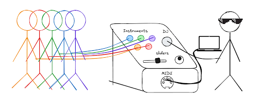

# Human DJ

[`[Report]`](/docs/final_report.pdf) [`[Flyer]`](/docs/demo-flyer.pdf)

Eva Schiller, Ishika Tulsian, Komron Aripov, Rohit Panse

The Human DJ is an interactive musical instrument powered entirely by human touch. Participants, each connected to the device via alligator clips, function as "keys" in a living, collaborative synthesizer. The DJ, who’s also wired up, produces music by interacting with people – it could be high fives, taps on the shoulder, fist bumps, you name it. When individuals touch each other, they complete an electrical circuit, allowing the system to detect these interactions using an Arduino through a measured change in voltage.

The system acts as a MIDI instrument, interfacing with music software and speakers to allow the DJ to curate the sound. The sounds can be chosen in-software based on a selection of notes on the octave scale, music samples, instruments, pre-recorded audio loops or more. The experience transforms human connection into music, creating a dynamic and fun environment for performance or play.

